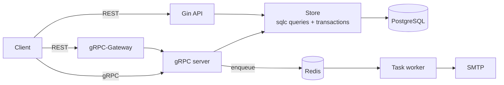

# SimpleBank

A payments backend in Go: accounts, money transfers, and a ledger of every money movement, served over both
gRPC and REST and deployed to AWS EKS.

## What it does

- **Accounts and transfers.** A transfer moves money between two accounts and records it three times: one
  transfer row and two ledger entries (one negative, one positive). All of it happens in one database
  transaction, so money is never created or lost halfway.
- **Safe under concurrency.** Many transfers can hit the same accounts at once. Rows are locked in a fixed order,
  so two opposite transfers (A→B and B→A) can't deadlock.
- **Users and auth.** Sign-up, login with PASETO or JWT access tokens plus refresh sessions, role-based access
  (depositor / banker), and email verification.
- **Background work.** Verification emails are sent by an async worker through a Redis task queue, so the
  sign-up request doesn't wait on SMTP.
- **One API, two protocols.** gRPC services, with a gRPC-Gateway exposing the same calls as REST and an
  OpenAPI spec.

## Architecture



| folder | job |
| --- | --- |
| `api/` | Gin REST handlers, middleware, auth |
| `gapi/` | gRPC handlers, interceptors |
| `db/migration` | schema migrations (golang-migrate) |
| `db/query`, `db/sqlc` | SQL and the type-safe Go generated from it (sqlc), transactions |
| `token/` | PASETO and JWT makers |
| `worker/` | Redis task distributor and processor (asynq) |
| `proto/`, `pb/` | protobuf definitions and generated code |
| `eks/` | Kubernetes deployment and service |

## Stack

Go · Gin · gRPC + gRPC-Gateway · PostgreSQL (pgx, sqlc, golang-migrate) · Redis (asynq) · PASETO / JWT ·
Docker · Kubernetes on AWS EKS · GitHub Actions

## CI/CD

- **Test** (every push and PR): spins up Postgres, runs migrations, runs `go test` against a real database.
- **Deploy** (push to `main`): builds the Docker image, pushes it to Amazon ECR, loads secrets from AWS Secrets
  Manager, and rolls it out to EKS.

## Run it locally

```bash
make postgres      # Postgres in Docker
make createdb
make migrateup
make redis         # Redis in Docker
make server        # gRPC + gateway + worker
make test
```

Or `docker compose up` for the whole stack.
